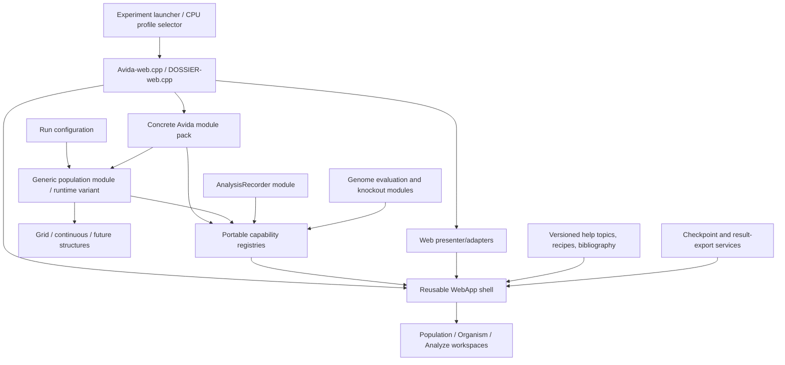

# Avida Web Interface Roadmap and Architecture

- Status: **draft for review**
- Owner: Charles Ofria
- Prepared: 2026-08-14

Scope: responsive interface, organism inspection, Analyze mode, persistence and data export, help and experiment guidance, CPU-model compatibility, web refactoring, runtime-selectable population structures, knockout analysis, and an Evoke-derived continuous population

## 1. Executive recommendation

The work should proceed as a sequence of usable releases rather than as one large interface rewrite:

1. **Make full-population checkpoints trustworthy.** Characterize the current failure before refactoring it, distinguish resumable checkpoints from configurations and result downloads, and add a versioned compatibility envelope plus save/continue equivalence tests. Large checkpoints should use downloaded files or IndexedDB blobs rather than the browser's small string-oriented local-storage freezer.
2. **Protect and repair the current interface.** Add browser-level smoke tests at representative viewport sizes, then restructure the Population workspace so each set of controls stays with the panel it controls. Add a desktop splitter only after the responsive structure is correct.
3. **Create reusable web boundaries before adding another major mode.** Keep `source/Avida-web.cpp` as a small composition root and extract browser interop, freezer/artifact storage, the Population workspace, and the Organism workspace incrementally. Introduce a generic population module that owns a closed variant of supported population structures so a web user can choose among them when configuring a run without recompiling. Do not make core scientific modules depend on `emp::web`.
4. **Add an integrated help and experiment-guide system.** Package versioned conceptual, task-oriented, contextual, and literature content with the application. Guides should begin from the experiment a user wants to perform, preview any configuration changes, and preserve citations to relevant Avida papers.
5. **Make CPU models explicit, swappable profiles.** Generalize only the boundaries exercised by the current AvidaVM and a new legacy heads-based CPU. Treat the latter as a named compatibility profile with golden execution traces against a precisely chosen Avida 2.x reference—not as an informal collection of similarly named instructions.
6. **Improve the Organisms view on the extracted component.** Replace the wide head column with a compact marker rail, add an annotation column, and display each VM stack as a real vertical stack. Initially show generated task annotations; persistence of user notes should follow an explicit saved-organism format decision.
7. **Build the first Analyze mode around recorded queries.** Avida's existing query system already supports values, traits, organism properties, population sets, and reductions. The first Analyze mode should let a user select recommended query presets or enter a query, record only selected values, and arrange series into synchronized graph panes that share an update x-axis. Results should be downloadable separately from resumable simulation state.
8. **Finish the isolated genome-evaluation primitive, then build knockout analysis on it.** The existing `analysis_plans.md` describes the necessary correctness and isolation work. Knockout results should be platform-independent data; the Organisms view should only render those results as annotations.
9. **Integrate Evoke last, as a runtime population alternative.** Evoke's reusable part is small and is primarily `emp::Physics2D` state and update logic. Port it into a concrete population implementation held by the generic population variant and give the web shell a continuous-world presenter; do not merge the old Evoke web interface into Avida.

This order first protects scientific reproducibility, then produces visible improvements, avoids adding Analyze mode to a 4,246-line source file, and establishes the hardware and population abstractions needed by legacy comparisons, DOSSIER-web, and the continuous world.

## 2. Current-state findings

The recommendations above are based on the current repository, including uncommitted work present on 2026-08-14.

### 2.1 Population layout

The narrow layout problem is structural, not merely a bad breakpoint:

- The primary mode controls and side-panel controls are siblings in the header.
- The population card and side-panel content are siblings in a separate workspace.
- At `995px`, both grids independently become one column.
- Consequently, side-panel controls appear before the population card while their content appears after it.

The fix is to change ownership in the document structure. The side-panel controls and active side-panel content should be children of one inspector region. CSS should then arrange two regions, not four independently ordered pieces.

### 2.2 Organisms view

The current execution row reserves at least `112px` for genome heads. It already supports multiple head markers per instruction through wrapping, but the generous lane takes space from information that is unique to each instruction. Stacks are rendered by converting the whole circular stack to a comma-separated string; that representation obscures which value is the top and cannot selectively show the first few entries.

The existing organism preview also already collects two useful annotation sources:

- step-specific analysis notes;
- task IDs and the execution positions at which tasks occur.

These should feed the first read-only annotation column before user-editable notes are introduced.

### 2.3 Analyze foundations

Analyze mode's header button currently has no callback and `ApplicationMode` contains only Population and Organism. However, the backend is not empty:

- `QueryManager` compiles typed expressions and supports population reductions such as minimum, maximum, mean, and sum;
- `base.update`, traits, organism properties such as `genome_length`, and module-registered values are queryable;
- modules can already contribute Population statistics and color modes through `PopulationViewOptions`;
- saved runs serialize the complete Avida module pack.

This is enough to avoid a second expression/metric system. What is missing is a discoverable catalog of recommended queries, a recorder with a sampling policy, and a chart workspace.

The separate [analysis infrastructure plan](../analysis_plans.md) concerns evaluating genomes in isolation. That work is a dependency of knockout tests and mutational analyses, but it is not a dependency of population time-series graphs. The two meanings of “analysis” should share a UI mode without being forced into one backend class.

### 2.4 Web coupling

`Avida-web.cpp` currently fixes one concrete module pack and directly requires `PopGrid`, `DriverBuffered`, `OrgTypeAvidian`, `ReactionsManager`, `EventManager`, and `AvidaVM`. This makes the file both the application shell and the implementation of every feature. A DOSSIER executable cannot reuse the shell without inheriting assumptions about grids, Avidian instruction hardware, and structured environment configuration.

There is already a useful convention to generalize: the application asks each module whether it implements `SetupPopulationView(...)`. The same compile-time, opt-in style can support recommended analysis series. It should not be stretched to make scientific modules emit HTML.

The web executable also should not equate every structural population choice with a different module pack or Wasm build. It should compile a reviewed set of concrete population implementations into a generic population module that owns a variant-like tagged union of those implementations. The user selects the active structure while configuring a new run. This closed runtime choice is intentional even if visiting the variant adds mild overhead: avoiding recompilation for choices such as a grid versus a continuous world is more important for the web product. It does not imply dynamic loading of arbitrary modules or changing population structure inside an active run.

### 2.5 Evoke

The relevant Evoke code is currently small: `World.hpp` owns an `emp::Physics2D` instance and Brownian/replication behavior, while `evoke-web.cpp` directly draws it. Random reproduction is embedded in `World::Update_Replicate()`. In Avida, reproduction already flows from VM divide through offspring creation and the placement lifecycle. Therefore the reusable design is the continuous physics and placement policy, not Evoke's random reproduction loop or its interface.

### 2.6 Full-population persistence

The web interface currently saves a run by serializing `Avida()` into an opaque string, pairing it with a configuration snapshot, and placing the complete freezer in `localStorage`. Loading creates and initializes a new Avida instance, deserializes over it, and then manually repairs AvidaVM instruction-set pointers. This reveals several likely failure classes that should be tested rather than guessed at:

- browser storage quota or string-size limits for large populations;
- normal startup side effects occurring before state is loaded;
- transient pointers, callbacks, caches, and derived module state not reconstructed after load;
- missing format, module-pack, instruction-set, or build compatibility checks;
- saves taken at an unsafe lifecycle point with buffered work still pending;
- serializers that omit state needed for deterministic continuation.

A saved run must be treated as a checkpoint with an explicit contract: loading it into a compatible build and advancing it must produce the same state as advancing the original run.

### 2.7 Results versus checkpoints

The current “Download Run” action downloads the serialized checkpoint. That is useful for resuming work but is not the data product a researcher normally wants after a run. The interface needs a separate result export containing recorded tables and their provenance, without genomes, VM memory/stacks, population slots, physics bodies, or other continuation state.

### 2.8 Help and alternate CPUs

There is no integrated experiment-oriented help architecture, and organism presentation is coupled to `AvidaVM`. The concrete module pack also fixes `OrgTypeAvidian` and its hardware at compile time. Runtime replacement inside an active population would conflict with Avida's compile-time phenotype and genome composition. A practical first design is therefore a named CPU profile selected before a run, with a shared launcher loading the matching web build. Checkpoints remain profile-specific, while configurations can be validated and translated where semantics permit.

## 3. Design principles

1. **Keep scientific state outside views.** Recording, knockout results, annotations, population positions, and saved artifacts must be usable natively and under Emscripten.
2. **Keep browser details outside scientific modules.** Core modules may register data and commands; web adapters decide how to render them.
3. **Compile capabilities; select population structure at runtime.** Avida should continue using compile-time composition and `requires` dispatch for optional module capabilities. The web module pack should nevertheless include a generic population module whose closed variant contains the supported concrete population structures, selected in configuration before a run. A modest variant-dispatch cost is acceptable to avoid requiring web users to recompile.
4. **Use stable IDs in saved and user-configurable state.** Labels may change. Queries, series, panes, notes, and view contributions need stable identifiers.
5. **Record intentionally.** Time-series data that was not selected cannot be reconstructed later. The interface must clearly distinguish “available now” from “recorded since update N.”
6. **Keep identity separate from annotation.** Notes do not change a genome's genetic identity and should not be members of `Genome` or participate in genotype equality.
7. **Never freeze the browser for long analyses.** Knockout sweeps and future phylogeny work must be incremental, show progress, and support cancellation.
8. **Checkpoint compatibility must be explicit.** Never deserialize opaque population state before verifying its schema, module pack, CPU profile, population structure, and required build features.
9. **Teach reproducibility, not just button locations.** Help and exported data should explain the model, configuration, assumptions, and provenance needed to understand or repeat an experiment.

## 4. Target web architecture

The final executable should be a composition root, not the web application implementation.



### 4.1 Three extension levels

Modules should gain an interface presence through the least specialized level that meets their needs:

1. **Automatic settings.** Continue building configuration controls from `SettingsManager` metadata. Module authors do not write UI code.
2. **Declarative data contributions.** Continue `SetupPopulationView(...)` and add a small `SetupAnalysisView(...)` registry for recommended queries, labels, descriptions, units, and default groupings. The registry contains no `emp::web` types.
3. **Custom web presenters.** A grid, continuous physics world, phylogeny, or other meaningful visualization gets a web-side adapter included by the executable. The scientific module exposes state through accessors; the adapter renders and interacts with it.

This avoids both extremes: hard-coding every module in the shell, and coupling every module to the browser.

### 4.2 Proposed responsibility boundaries

Names are illustrative and should be confirmed while extracting the first component.

| Responsibility | Proposed location | May depend on |
|----|----|----|
| Emscripten/DOM bridges | `source/web/BrowserInterop.hpp` | Emscripten, browser DOM |
| Freezer records, schema upgrades | `source/web/FreezerStore.hpp` initially | serialization, artifact types |
| Checkpoint envelope and compatibility | `source/core/Checkpoint.hpp` | serialization, module/profile IDs |
| Result datasets and provenance | `source/core/RunResults.hpp` | portable dataset registry |
| Shared header, mode switching | `source/web/WebApp.hpp` | generic app controller |
| Runtime population selection and lifecycle forwarding | `source/core/PopVariant.hpp` (illustrative) | supported concrete population structures |
| Population transport and inspector | `source/web/PopulationWorkspace.hpp` | generic app plus population presenter |
| Grid canvas, hit testing, placement | `source/web/GridPopulationPresenter.hpp` | `PopGrid` |
| Organism execution UI | `source/web/AvidianOrganismPresenter.hpp` | `OrgTypeAvidian`, `AvidaVM` |
| Analyze charts and controls | `source/web/AnalyzeWorkspace.hpp` | analysis recorder/catalog |
| Reactions configuration | `source/web/ReactionsConfigPresenter.hpp` | `ReactionsManager` |
| Event configuration | `source/web/EventConfigPresenter.hpp` | `EventManager` |
| Help browser and contextual links | `source/web/HelpWorkspace.hpp` | packaged help catalog |
| CPU-specific organism visualization | `source/web/*HardwarePresenter.hpp` | one hardware profile |

The extraction should be incremental. First move code with a clear boundary and unchanged behavior; do not start by replacing the entire application with a new framework.

### 4.3 Capability handling

The reusable shell must not call `GetPlugIn<PopGrid>()` or `GetPlugIn<DriverBuffered>()`. Driver and other optional-module access belongs in adapters that are included only when those modules are in the executable. Population access goes through the generic population module and its stable capability surface. The population presenter may visit the active concrete alternative to obtain a specialized grid, continuous-world, or future structural presenter.

Adapter packs can otherwise use the same tuple plus `requires` dispatch style as `PlugInManager`. Runtime dispatch is explicitly permitted at the population-structure boundary; it should not leak into instruction execution or unrelated simulation hot paths.

The first proof that this boundary is real should be a minimal DOSSIER-web composition that builds a shell with only the capabilities DOSSIER actually has. It need not have feature parity immediately.

### 4.4 Runtime-selectable population structures

The generic population module should own a closed `std::variant`-style set of concrete population implementations compiled into the executable. Its responsibilities are to:

- register a stable population-structure setting and describe the available alternatives;
- construct the selected alternative when a new run is initialized;
- forward population lifecycle signals and common operations to the active alternative;
- expose common queries and a safe visitation/capability API for structure-specific operations;
- serialize the active alternative tag and its complete state; and
- reject a checkpoint when its population alternative is unavailable or incompatible.

Changing the setting starts or resets a run; it does not transform a live grid into a continuous world. The configuration, checkpoint envelope, result provenance, help system, and interface should all use stable population-structure IDs. A given executable may support a different closed set of alternatives, but the standard web build should include the commonly used choices so selecting one never requires the user to compile Avida.

The first design review should compare direct `std::visit` forwarding, a small type-erased common interface, and any module-system-specific tagged-union approach. Favor clear lifecycle and serialization behavior over eliminating a measured-small dispatch cost. Do not duplicate Biota or other authoritative organism state merely to normalize the alternatives.

## 5. Full-population checkpoints and data-only results

### 5.1 Product vocabulary

The interface should present four distinct operations:

- **Save checkpoint:** capture everything required to resume the exact run.
- **Load checkpoint:** validate compatibility, restore, and continue the run.
- **Save configuration:** retain experiment setup without population state.
- **Download results:** export recorded scientific data and provenance without continuation state.

Using these names consistently will prevent users from mistaking a large opaque checkpoint for an analysis dataset.

### 5.2 Diagnose before redesign

Create a deterministic state fingerprint that covers, at minimum:

- update, run state, and both random-number streams;
- active Biota slots, global IDs, genomes, mutation flags, and all serialized traits;
- hardware genome, memory, heads, stacks, counters, and organism IDs where present;
- population-module placement state, including the entire grid;
- driver scheduling state and pending-work invariants;
- genotype/reaction/event and other module state that affects future execution;
- recorded analysis data once that module exists.

Use the fingerprint in two tests:

1. **Immediate round trip:** run to update N, save, load, and compare state at N.
2. **Continuation equivalence:** from the same state at N, advance the original and restored runs M updates and compare at N+M.

Test empty, sparse, partially full, and completely full populations; also test save/load while paused after both Step and Fast-forward. The first task should report the first divergent component and root cause before changing the format.

### 5.3 Checkpoint envelope

Wrap the serialized payload in a versioned envelope containing:

```text
magic and checkpoint schema version
Avida source/build version
concrete module-pack fingerprint and ordered module IDs
CPU profile and instruction-set compatibility ID
active population-structure ID and compatibility version
configuration snapshot/schema version
payload encoding and length
optional integrity hash
serialized Avida state
```

Validate the envelope before constructing or mutating the current run. An incompatible checkpoint should produce a useful explanation, not a failed assertion or partially loaded population.

Saving must occur at a safe boundary with the run paused and no pending offspring or incomplete module transaction. Loading needs a dedicated lifecycle:

1. create the exact compatible module pack without injecting or advancing a population;
2. register settings, traits, instructions, and callbacks;
3. deserialize state;
4. trigger an optional `AfterLoad()` signal so modules rebuild transient pointers, indexes, caches, and browser callbacks from serialized authoritative state;
5. validate `Avida().OK()` plus cross-module invariants before exposing the run.

The current manual call that restores AvidaVM instruction-set pointers should become one module's `AfterLoad()` implementation, not a special case in the web interface. Every module with an empty or partial `Serialize()` should be audited to confirm that omitted state is either irrelevant or reconstructed during the load lifecycle.

### 5.4 Browser storage

Do not put large checkpoint payloads in `localStorage`. Use:

- a downloaded checkpoint file for explicit, portable saves;
- IndexedDB blobs for optional browser-local checkpoints;
- `localStorage` only for small preferences and a lightweight catalog if needed.

The UI should report estimated/actual checkpoint size, save success, and storage errors. Import must support a user-selected checkpoint file as well as a browser-local item. A failed save must never be shown as complete merely because a small metadata record succeeded.

### 5.5 Data-only result package

Define a portable `RunResults`/dataset registry to which recorders and output modules contribute named rectangular tables. A data-only export should include:

- one CSV (or equivalent documented table) per dataset;
- a manifest naming columns, units, descriptions, sampling intervals, and missing-value rules;
- run provenance: Avida version, module IDs, CPU profile, instruction-set ID, population-structure ID, random seed, start/end updates, and completion reason;
- the effective configuration, or a manifest reference to it, for reproducibility;
- no extant population, organism hardware state, pending work, or physics state.

Users should be able to download one dataset or an “all results” package. Archive/container format is a separate implementation choice; the logical dataset and manifest model must not depend on ZIP or a browser library. Results must remain available after run teardown clears the live population.

Checkpoint files and result packages need different extensions, MIME types, labels, and icons.

### 5.6 Persistence acceptance criteria

- A full default grid can be checkpointed, reloaded, and continued without hitting browser string storage limits.
- Immediate and continuation-equivalence fingerprints match for all tested population occupancies.
- An incompatible module pack, CPU profile, or unavailable population structure is rejected before deserialization with a clear error.
- Corrupt/truncated input cannot replace the current run.
- “Download Results” produces readable scientific tables and provenance but no resumable population state.
- Results can be downloaded after normal completion and after a user pause.

## 6. Help and experiment guidance

### 6.1 User journeys

The help system should support four complementary entry points:

1. **What is Avida?** Digital evolution concepts, organisms, genomes, instructions, updates, mutation, selection, tasks, fitness, and populations.
2. **What do I want to investigate?** Guided experiment recipes such as adaptation to logic tasks, mutation-rate effects, drift and population size, lineage change, organism execution, knockout effects, and comparison to a published experiment.
3. **What does this control or display mean?** Contextual help anchored to modes, panels, settings, graph series, instruction annotations, and error messages.
4. **What has prior Avida research done?** A curated, searchable literature map connecting concepts and recipes to papers, with short relevance summaries and stable DOI or publisher links.

The goal is not merely an API reference. A new user should be able to choose a scientific question, understand the model assumptions, configure a small experiment, know what to record, run it, and interpret/export the result.

### 6.2 Content architecture

Store help outside C++ source as versioned Markdown plus structured metadata:

```text
topic id, title, summary, body asset
audience/level and prerequisite topic IDs
applicable modes, module IDs, CPU profiles, population-structure IDs, and setting IDs
context anchor IDs
related recipe and bibliography IDs
content version and last technical review
```

Package core content with the web build so basic help works offline. Build a lightweight local search index during the web build rather than requiring a server. External paper links may require network access, but complete citations and relevance summaries should remain visible offline.

Modules may register help-topic IDs and contextual anchors through portable metadata. They should not embed long prose or HTML in module headers. CPU- and module-specific help should appear only when the corresponding capability is active.

### 6.3 Guided recipes

A recipe should state:

- the scientific question and expected learning outcome;
- model/CPU assumptions and relevant prior work;
- configuration changes and why they matter;
- what data to record before starting;
- run length or stopping guidance;
- plots/analyses to inspect and common interpretation mistakes;
- reproducibility/export steps;
- related recipes and papers.

If a recipe can apply settings automatically, first show a diff from the current configuration and require confirmation. Applying a recipe creates a new configuration state; it must never silently modify a running experiment. A “Try a small version” path should favor short browser-friendly runs.

### 6.4 Literature and content governance

Bibliography records should include authors, title, year, venue, DOI/stable URL, and topic tags. Every paper summary and reproduction recipe should be reviewed for scientific accuracy. Distinguish clearly between:

- historically reproduced behavior;
- a modern Avida approximation of an older experiment;
- a teaching exercise inspired by a paper.

Help content evolves separately from executable state, but each page should identify the Avida and CPU profiles it describes. Broken-link checks, duplicate citation checks, Markdown rendering, and context-anchor validation belong in the build/test workflow.

### 6.5 Help MVP acceptance criteria

- Help is reachable globally without losing the current experiment state.
- Population, Organisms, Analyze, configuration, save/checkpoint, and result-export controls have contextual help links.
- At least three end-to-end experiment recipes work with the current module pack.
- Each initial recipe names data to record and includes technically reviewed citations.
- Search finds both conceptual terms and experiment goals.
- Inactive-module or wrong-CPU instructions are hidden or clearly marked incompatible.

## 7. Alternate CPU models and Avida 2.x compatibility

### 7.1 Profile model

A CPU model is a startup-only compatibility profile with stable IDs for:

- hardware implementation;
- instruction set and instruction ordering/names;
- genome file interpretation;
- divide/copy semantics;
- default scheduler, mutation timing, environment/input behavior, and other settings required for a meaningful comparison.

The CPU cannot be swapped inside a live population or checkpoint. The web experience can still make selection easy: a shared experiment launcher chooses a profile before a run and loads the matching Wasm bundle/build. The active profile remains visible in configuration, help, checkpoints, and result provenance.

This compile-time profile approach fits Avida's current module/phenotype composition and avoids a runtime variant or virtual dispatch in every executed instruction. A future single-bundle launcher should be considered only if separate builds become an actual deployment problem.

This restriction is specific to CPU/hardware composition. Population structure has a much coarser dispatch boundary and is deliberately selected at runtime through the generic population variant described in section 4.4. A user may therefore choose a grid or continuous population without a new web build, while choosing a different CPU profile may still load a different compatible Wasm bundle.

### 7.2 Reusable hardware boundary

Generalize hardware-dependent code only when both the current AvidaVM and the heads-based model use the new boundary. Likely capabilities include:

- load/format a genome and describe its instruction set;
- create and reset hardware for an organism;
- execute one cycle and report analysis events;
- provide offspring/divide results;
- expose named heads, stacks/registers, memory, and per-instruction display annotations where they exist;
- provide neutral-site behavior for knockout evaluation;
- serialize authoritative state and rebuild transient instruction/callback pointers after load.

The Organisms workspace should consume a hardware presenter/registry rather than constants such as `AvidaVM::NUM_NOPS` or fixed head IDs. A CPU without stacks or memory simply omits those panels.

Possible implementation shapes include two concrete `OrgType...` modules or a shared `OrgTypeProgram<AVIDA_T, HARDWARE_T>` template. Choose the shared template only after the second CPU demonstrates identical setup/lifecycle code; do not generalize from the current CPU alone.

### 7.3 Heads-based compatibility target

“Avida 2.0 execution” must be narrowed to an exact legacy reference version, instruction-set file, and configuration profile before implementation. Direct comparison may depend on more than CPU instruction functions, including:

- instruction pointer advancement and Nop/template matching;
- read, write, flow, and allocation head semantics;
- circular genome behavior and copy/divide validation;
- stack/register initialization and overflow behavior;
- input/output and task timing;
- mutation application timing and random-number consumption;
- merit, gestation, scheduler, birth placement, and death behavior.

Port the model as a new implementation; do not distort the modern AvidaVM with compatibility flags. Where exact behavior is intentionally not reproduced, record the difference in the profile and help system so comparisons are not overstated.

### 7.4 Compatibility verification

Create golden fixtures from the chosen legacy implementation:

- known genomes and instruction-set mappings;
- per-cycle traces of IP/heads, registers/stacks, copied genome, outputs, and errors;
- successful and failed divide cases;
- task outputs and gestation measurements;
- seeded multi-organism runs with expected population/genotype summaries.

Compare step by step and report the first divergence. A profile may be labeled “Avida 2.x compatible” only after the agreed fixture suite passes. Also test legacy genome import/export and checkpoint rejection across CPU profiles.

### 7.5 CPU-profile acceptance criteria

- Choosing a CPU profile before a run is obvious and the active choice remains visible.
- The modern profile shows no behavior or performance regression from the refactoring.
- The heads-based profile passes the approved legacy golden-trace suite.
- Organism inspection adapts to the active hardware without hard-coded AvidaVM layout assumptions.
- Checkpoints reject the wrong profile; result exports name the exact compatibility ID.
- Help accurately distinguishes modern behavior, reproduced legacy behavior, and known differences.

## 8. Responsive Population workspace

### 8.1 Document structure

Use this ownership and source order:

```text
application
  primary header
    logo
    primary mode navigation
  population workspace
    population region
      population surface
      transport and color controls
    inspector region
      inspector navigation
      active inspector content
```

On a wide screen, the regions form two columns. On a narrow screen, source order naturally becomes: population region, inspector controls, inspector content. The inspector controls can no longer land between the population canvas and its transport controls.

### 8.2 Sizing and adjustment

- Keep the population surface square by default.
- Size the initial left pane from both available width and viewport height, as the current design does, so the canvas and transport can remain visible together.
- Add an accessible splitter between regions on wide layouts. Pointer dragging adjusts the left pane; Left/Right arrows adjust it in fixed increments; Home or double-click restores the default.
- Constrain both panes to useful minima. Never let resizing hide the transport controls or make the inspector unusably narrow.
- Disable the splitter in stacked mode. Remember the desktop preference in browser storage, but do not put layout preferences in saved runs.
- Let large inspector sections collapse independently. Configuration can scroll within its region; compact run statistics should not require a full-page scroll.

Container queries would make reusable workspaces respond to their allotted width rather than the whole viewport. A regular media query is an acceptable first implementation if it is covered by the same viewport tests.

### 8.3 Acceptance criteria

- At widths 1440, 1024, 800, 600, and 360 CSS pixels, controls are adjacent to the content they govern and no horizontal page scrollbar appears.
- At short desktop heights, the population canvas plus transport remain reachable without losing inspector access.
- At wide sizes, resizing either pane updates the canvas correctly and remains usable with keyboard controls.
- Population selection, context menu, drag/drop, color modes, configuration, and transport keyboard shortcuts still work.

## 9. Organisms workspace and annotated genomes

### 9.1 Genome row layout

Each instruction row should use four semantic areas:

```text
[head marker rail] [position] [instruction] [annotations / notes]
```

- Reduce the head rail from its current `112px` minimum to approximately `36–48px`.
- Use compact symbols or short labels. When multiple heads point to one instruction, stack the markers vertically and let that row become taller; do not widen the whole column.
- Preserve click-to-follow, focus states, tooltips, and a text label available to assistive technology.
- Give annotations all remaining horizontal space. At narrow widths, place annotations on a second row beneath the instruction rather than hiding them.

Default annotation layers:

- first output of each configured task;
- later output occurrences, optionally collapsed to a count;
- successful divide / replication involvement when known;
- knockout effects when a sweep has been run;
- user-authored notes.

Users should be able to filter annotation layers so a heavily analyzed genome does not become unreadable.

### 9.2 Stack display

Expose indexed stack access or iteration in `VMStack`; do not parse `ToString()` in the view.

- Place stacks A–F side by side where space allows.
- Render the top value at the top and mark it explicitly.
- Show a small default window, for example the top 4–6 entries.
- Give each stack its own vertical overflow or an expand control for all 16 entries.
- Show zero values as real entries when expanded so the circular fixed-depth hardware is not misrepresented.

The existing `ToString()` order is useful for textual diagnostics and need not change.

### 9.3 Saved comments

Recommended model:

```text
OrganismArtifact<genome_t>
  genome
  site notes: (site index, note id, user text)
  artifact-level notes
  schema/version metadata
```

Do not store notes inside `Genome`; they should not affect mutation, equality, genotype IDs, or execution. Generated task and knockout annotations are reproducible results and should not silently become user comments.

For downloaded `.org` files, a compatible human-readable representation is one instruction per line with an optional `//` comment. The current instruction loader already discards `//` comments, so old loaders can still execute such files. A new artifact parser must retain comments before handing the instruction text to the existing genome loader.

Changing the freezer from V2 to V3 and defining round-trip behavior is a serialized-format decision and should be approved separately. Migration from V2 should create artifacts with empty note maps.

## 10. Analyze mode: time-series MVP

### 10.1 Separate catalog, recording, and presentation

Analyze mode should consist of three layers:

1. **Catalog:** named presets and optional advanced query entry.
2. **Recorder:** compiled numeric queries, sampling policy, and recorded points.
3. **Workspace:** series selection, pane assignment, legends, axes, inspection, and export.

The recorder should be a platform-independent Avida module so its state serializes with a saved run and can also be used by a native executable. The web workspace controls it but does not own the scientific data.

### 10.2 Series definition

A recorded series needs at least:

```text
id                 stable identifier
label              user-facing name
description        explanation and provenance
query              compiled Avida query source
unit               optional unit/dimension label
sample interval    every N updates
start update       when recording began
points             (x value, numeric value or missing)
```

Initial presets should include:

- organism count;
- minimum, mean, and maximum genome length;
- minimum, mean, and maximum fitness when fitness is registered;
- generation and task/reaction counts contributed by active modules.

Modules should contribute presets with `SetupAnalysisView(...)`. Users may add an arbitrary numeric query in an Advanced section. Compile once when recording begins; do not reparse every update.

Empty populations, non-finite results, and invalidated queries must produce a missing sample and a visible status, not a misleading zero.

### 10.3 Recording policy

- Record only selected series.
- Default to every update for short interactive runs; allow a larger interval.
- Make “recording starts now” explicit. A newly selected value has no historical data.
- Place a configurable point limit on each series. When reached, either stop with a warning or use a reviewed downsampling policy; do not silently discard precision.
- Sampling should occur at a documented lifecycle point, preferably `OnUpdateEnd`, after modules have finalized their values for that update.
- Pausing, stepping, restarting, loading a run, and changing selections need explicit behavior. Recommended: restart clears the current recording after confirmation; saved-run load restores serialized recorder state.
- CSV export should include the query, label, unit, and start/update metadata as well as samples.

### 10.4 Graph model

Use a **plot group** containing one or more vertically stacked panes:

- all panes share and synchronize the x-axis;
- each pane owns one y-axis and may contain multiple compatible series;
- min/mean/max genome length are three lines in one pane;
- a series with a very different scale or unit can be moved to a new pane;
- crosshair, zoom window, and update readout are synchronized.

This is easier to interpret than multiple left/right y-axes drawn over the same plot and directly satisfies the request to split values with different y scales. A dual-axis overlay could be added later if a concrete use case requires it.

For the MVP, updates are the only x-axis provider. Store x values explicitly and define an axis ID so a future lineage recorder can provide lineage-step or ancestor identifiers without changing the time-series point format. Phylogenies and distributions-over-time should be separate analysis tools, not forced into the line-chart abstraction.

### 10.5 Chart implementation choice

Two options are reasonable:

- **Repository-native canvas/SVG renderer:** no new dependency, small payload, complete control, but axes, interaction, accessibility, and export require more implementation and testing.
- **A dedicated plotting dependency:** faster path to mature interaction, but adds a dependency, asset/build decisions, licensing review, and integration risk under Emscripten.

Recommendation: define the recorder and plot-group model independently of the renderer, then make a separate dependency decision before implementing the graph. Do not let a chart library's internal data model become the saved analysis format.

### 10.6 Analyze MVP acceptance criteria

- Analyze mode is reachable and accurately indicates whether recording is active.
- Users can record organism count and min/mean/max genome length on one graph.
- Users can create a second synchronized pane and move a series into it.
- Sampling works identically during Step, Play, and Fast-forward.
- Adding a series mid-run starts at the current update and does not invent history.
- Save/load and CSV export retain the recorded values and series metadata.
- A long fast-forward run remains responsive within the documented series/point limits.

## 11. Knockout analysis

Knockout analysis depends on the isolated, phenotype-producing evaluator described in `analysis_plans.md`. It should not be implemented by repeatedly driving the current HTML trace.

### 11.1 Semantics

For each genome site, evaluate an otherwise identical genome in which that site is replaced by an instruction that has no effect and is not a Nop modifier. This distinction matters: replacing a site with `Nop-A` would allow neighboring instructions to consume it as an argument and is not neutral.

For AvidaVM, the clean implementation is an analysis-only neutral instruction or equivalent analysis overlay that:

- occupies a non-Nop instruction identity when neighboring instructions inspect it;
- advances normally when executed;
- does not alter stacks, heads, memory, output, or other instructions;
- cannot appear through live mutation unless that is separately desired.

The generic knockout module should ask the organism representation/evaluator for this behavior rather than assuming an AvidaVM instruction encoding.

### 11.2 Result model

Each site result should record:

- whether the wild type and knockout replicate within the evaluation limit;
- gestation cost and fitness deltas where meaningful;
- task/trait gains and losses;
- quantitative deltas for selected numeric traits;
- evaluation conditions, including inputs, seed/sample set, and cycle cap.

Classifications are summaries of evidence, not intrinsic labels:

- **replication-required:** wild type replicates and knockout does not;
- **task-required:** a wild-type task disappears in the knockout;
- **quantitative effect:** a selected trait changes beyond its configured comparison tolerance;
- **no detected effect:** no selected output changes under the tested conditions.

Avoid calling the last category “neutral” without qualification; a site may matter in untested environments.

### 11.3 Execution and UI

- Use identical deterministic inputs across wild type and all knockouts in a sweep.
- Run incrementally with progress, cancellation, and a documented cycle limit.
- Cache results by genome identity plus evaluation-condition identity.
- Show default replication and task badges in the instruction annotation column.
- Let users choose additional traits and inspect exact wild-type/knockout values.
- Allow export of a site-by-result table.

## 12. Continuous population from Evoke

### 12.1 Scientific module

Create a `PopContinuous`-style population implementation that owns the physics world and participates in normal Avida lifecycle signals. It should become one concrete alternative in the generic population variant, not require its own web executable or a source change to activate it.

- `OnInjectReady` or placement setup assigns an initial body position.
- `OnOffspringReady` chooses an offspring position near the parent and can inherit body traits.
- `OnPlacement` activates the body-to-organism association.
- `BeforeDeath` removes/deactivates the associated body.
- A chosen update signal advances physics and Brownian motion.
- Reproduction is triggered only by Avida's successful divide and offspring lifecycle; remove Evoke's random `Update_Replicate()` behavior.

Body associations should store both the Biota slot and global organism ID, or use an equivalent validated handle. Both Biota and physics containers recycle indices, so a bare index in either direction is insufficient.

### 12.2 Web presenter

The continuous-world presenter should render the physics state, translate pointer positions into body selections, and expose color modes from the same population data catalog where possible. The generic shell should only know that it has a population presenter; it should not assume width, height, square cells, or grid hit-testing. Presenter selection should follow the active population alternative through the generic population capability API.

### 12.3 First integration spike

Before porting all Evoke behavior, prove this vertical slice:

1. one Avidian ancestor appears as one physics body;
2. its successful Divide produces one Avida offspring and one nearby body;
3. selecting a body opens the existing organism inspector;
4. death removes the correct body;
5. save/load preserves enough population-module state to resume.

Links, clusters, variable radii, flow controls, and richer continuous-world experiments should follow only after this identity/lifecycle slice is correct.

## 13. Recommended delivery plan

| Release | Deliverable | Depends on | Review gate |
|----|----|----|----|
| 0 | Checkpoint and viewport characterization harnesses | current builds | fingerprint and viewport coverage |
| 1 | Full-population checkpoint correctness and envelope | Release 0 | format/profile IDs and browser storage |
| 2 | Responsive Population ownership fix | Release 0 | source order and splitter behavior |
| 3 | Browser/storage/workspace extraction, capability boundary, and runtime population-variant design | Releases 1–2 | proposed file/API and lifecycle boundaries |
| 4 | Help workspace, contextual anchors, and three starter recipes | Release 3 | content model and citation review |
| 5 | Compact genome rows and real stack display | Release 3 | hardware presenter and annotation design |
| 6 | CPU-profile interface and legacy golden-fixture harness | Release 3 | exact Avida 2.x reference target |
| 7 | Heads-based compatibility CPU profile | Release 6 | documented compatibility differences |
| 8 | Query-based recorder and Analyze workspace shell | Release 3 | recorder schema and chart renderer |
| 9 | Time-series graph panes and data-only result export | Release 8 | data package and point-limit policy |
| 10 | Annotated organism artifact and user notes | Release 5 | freezer V3 and `.org` comment syntax |
| 11 | Isolated evaluator completion | existing analysis plan | input policy and viability cap |
| 12 | Knockout module and organism annotations | Releases 5 and 11 | comparison semantics |
| 13 | Minimal DOSSIER-web composition | Release 3 | capability gaps found by spike |
| 14 | Continuous population alternative in the runtime variant | Releases 3 and 13 | stable body/organism mapping and variant serialization |

After Release 3, help content, CPU compatibility, population time series, and isolated evaluation are separate workstreams. They can proceed concurrently with separate owners, but each public API and serialized-format gate still needs explicit review.

## 14. Decisions reviewers should make

The following choices are expensive enough to resolve explicitly before their implementation:

1. **Checkpoint identity and storage:** approve schema/module/CPU compatibility IDs and choose download-only versus IndexedDB support for browser-local checkpoints.
2. **Legacy compatibility target:** choose the exact Avida 2.x version, instruction-set file, scheduler/environment profile, and authoritative way to generate golden traces.
3. **CPU-profile delivery:** approve separate Wasm builds behind one launcher versus another deployment model.
4. **Runtime population variant:** approve the initial concrete alternatives, stable IDs, common capability/visitation API, lifecycle forwarding, and whether selection is locked once a run has been initialized.
5. **Help governance:** identify initial experiment recipes, authoritative paper bibliography, and scientific reviewers for summaries and reproduction claims.
6. **Result package:** approve required provenance, archive/container format, and whether the effective configuration is always included.
7. **Saved organism notes:** approve an `OrganismArtifact` plus freezer V3, and decide the exact `.org` comment round-trip rules.
8. **Chart renderer:** repository-native rendering or an approved third-party dependency.
9. **Recorded-data limits:** stop at a cap, decimate, or maintain multi-resolution summaries.
10. **Restart/load behavior:** confirm when recordings clear, persist, or branch.
11. **Evaluator input policy:** fixed input pair versus a fixed sample and aggregation; this affects all knockout conclusions.
12. **Viability cycle cap:** approve the setting and live-population implications described in `analysis_plans.md`.
13. **Continuous-world boundary behavior:** wrapping, reflecting, or bounded physics, and whether crowding can make a valid divide fail placement.

## 15. Verification strategy

Every implementation slice should compile with the appropriate C++23/Emscripten Makefile target without warnings and should add the narrowest durable behavioral test it needs.

The persistence harness should cover:

- immediate checkpoint round trips and continuation equivalence;
- empty, sparse, partially full, and full populations;
- every compiled population alternative, including preservation of the active variant tag;
- safe-boundary invariants and module `AfterLoad()` reconstruction;
- incompatible module/CPU profiles and corrupt/truncated files;
- file downloads, file imports, quota/storage failures, and failure messages;
- data-only exports that contain tables/provenance and exclude population continuation state.

The web harness should cover:

- DOM structure and visibility for all primary modes plus Help;
- screenshots at agreed wide, intermediate, tablet, and phone viewports;
- absence of horizontal page overflow;
- transport and keyboard behavior;
- panel selection and proximity after responsive collapse;
- canvas redraw and hit testing after resize;
- recorder sample counts under Step, Play, and Fast-forward;
- saved artifact/recorder migration round trips;
- contextual help anchor validity, recipe setting diffs, local search, and citation metadata.

CPU compatibility tests should compare the first divergent cycle in golden legacy traces and cover instruction mapping, head/register/stack state, copy/divide, outputs/tasks, mutations, gestation, and seeded population summaries.

Visual snapshots should be reviewed intentionally when design changes; they should not replace semantic assertions about which control owns which panel.

## 16. Ready-to-use development prompts

These prompts are deliberately scoped to produce reviewable changes. Use them in order unless a review decision changes the roadmap.

### Prompt 1: diagnose full-population save/load

> Diagnose the current full-population save/load failure without implementing a fix yet. Read section 5 of `docs/avida-web-roadmap-design.md`, inventory every field serialized by Avida, Biota, Organism, AvidaVM, and the active modules, and trace the exact web SaveRun/LoadFrozenRun lifecycle. Add a deterministic test-only state fingerprint and reproduce immediate round trips for empty, sparse, partially full, and full grids. Also compare an uninterrupted continuation against a save/load continuation for a fixed seed. Check browser localStorage size/quota separately from serializer correctness. Report the first divergent field or failing layer, all omitted/transient state, and the smallest viable fix options. Do not change a public format or API in this task.

### Prompt 2: implement reliable checkpoints

> Using the approved diagnosis, implement Release 1 from `docs/avida-web-roadmap-design.md`. Add the approved versioned checkpoint envelope, compatibility validation, safe save boundary, generic module `AfterLoad()` reconstruction, and file import/export. Do not store full population blobs in localStorage; use the approved downloaded-file/IndexedDB design. Reject incompatible or corrupt input before replacing the current run. Make all immediate and continuation-equivalence tests pass for a full default grid, then verify native and web builds.

### Prompt 3: viewport regression harness

> Inspect the current Avida web build and add a minimal browser smoke-test harness for the existing interface. Cover viewports 1440x900, 1024x768, 800x900, 600x900, and 360x800. Assert that there is no horizontal page overflow, capture screenshots, and record the bounding boxes/source order of the Population canvas, transport controls, side-mode controls, and active side panel. Do not change production layout in this task. Use the existing Makefile and bundled workspace browser dependencies; do not add a third-party dependency. Run the web build and tests, then summarize the current failures with screenshot paths.

### Prompt 4: responsive Population workspace

> Implement Release 2 from `docs/avida-web-roadmap-design.md`. Restructure the Population-mode DOM so the population surface and transport are one region, while side-mode controls and active panel content are a second inspector region. On narrow screens the entire population region must come before the inspector controls and content. Preserve all current behavior and visual style. Update the viewport harness to assert control/content proximity at every target width. Do not add the draggable splitter yet. Build with `make web-quick`, run the browser tests, and report any visual snapshots that need review.

### Prompt 5: extraction plan and first boundary

> Using sections 4–7 of `docs/avida-web-roadmap-design.md`, propose the smallest safe extraction from `source/Avida-web.cpp` that moves one cohesive responsibility into `source/web/` without behavior changes and moves portable checkpoint/result types toward `source/core/`. Show the exact proposed files, dependencies, and public APIs before editing because this affects reusable architecture. Prefer one browser interop, storage, or value-model boundary over a broad rewrite. After I approve the boundary, implement only that extraction and verify web and persistence tests.

### Prompt 5a: runtime-selectable population design

> Design the generic runtime-selectable population module described in section 4.4 of `docs/avida-web-roadmap-design.md`; do not implement it yet. Inventory the lifecycle signals, settings, queries, serialization, placement operations, and web assumptions currently tied to `PopGrid`. Propose a closed variant that can contain `PopGrid`, the planned continuous population, and future concrete structures in one web build. Compare direct `std::visit` forwarding with a small type-erased common interface, define stable alternative IDs and checkpoint compatibility, explain how configuration selects an alternative before a new run, and show how specialized web presenters discover the active alternative without making the generic shell grid-aware. Include expected dispatch locations and performance implications; mild overhead at this coarse boundary is acceptable. Present exact public APIs, ownership, migration steps, and focused tests for review. Do not support changing structure inside a live run or require web users to recompile.

### Prompt 6: help-system MVP

> Design and implement the Help MVP from section 6 of `docs/avida-web-roadmap-design.md`. Keep versioned Markdown and structured bibliography/topic metadata outside C++ source, package core help for offline use, and add global help, local search, and contextual anchors for Population, Organisms, Analyze, configuration, checkpoints, and result export. Create three end-to-end experiment recipes that begin with scientific questions, preview configuration changes before applying them, name the data to record, explain interpretation pitfalls, and cite technically relevant prior Avida papers using verified publication metadata. Mark all historical reproduction claims for scientific review. Add content/link/anchor tests and visually verify the help workspace at wide and phone widths.

### Prompt 7: alternate CPU and legacy compatibility design

> Design Release 6 from section 7 of `docs/avida-web-roadmap-design.md` before implementing a new CPU. Inventory every current dependency on OrgTypeAvidian, AvidaVM, fixed heads, stacks, memory, callbacks, genome parsing, divide behavior, serialization, and organism rendering. Compare two concrete designs: named compile-time CPU profiles behind a shared web launcher, and runtime hardware selection. Recommend one with performance, checkpoint compatibility, deployment, and UI tradeoffs. Identify the exact legacy Avida version/instruction-set/configuration evidence needed for an “Avida 2.x compatible” claim and propose a golden per-cycle trace format. Present public APIs and the reference-fixture plan for approval; do not add speculative abstractions or claim compatibility yet.

### Prompt 8: compact genome and stack layout

> Implement the Organisms-view layout from section 9 of `docs/avida-web-roadmap-design.md`, without adding persistent user notes yet. Make the genome head lane 36–48px, vertically stack multiple head markers by increasing only that instruction row's height, preserve click-to-follow and accessibility labels, and add a right-side annotation area showing the already-collected task execution information. Add indexed/iterable read-only access to `VMStack` and render stacks A–F side by side with the top value at the top, 4–6 entries visible by default, and access to all 16 entries by scrolling or expanding. Do not change `VMStack::ToString()` behavior. Add focused tests, build the web target, and visually verify wide and narrow layouts.

### Prompt 9: Analyze recorder design/API

> Design the platform-independent query-based recorder described in section 10 of `docs/avida-web-roadmap-design.md`. Reuse `QueryManager`; do not invent a second metric expression language. Specify the exact series, sample, lifecycle, serialization, missing-value, and error types, plus a `SetupAnalysisView(...)` preset registry that modules can optionally contribute to. Address sampling during Step/Play/Fast-forward, point limits, restart/load semantics, result dataset registration, and query compilation timing. Do not implement until you present the public API and serialized-format choices for approval.

### Prompt 10: Analyze graphs and data-only results

> Implement the approved recorder API and an Analyze-mode MVP. Add organism count and min/mean/max genome length presets, allow selected series to begin recording from the current update, and render multiple lines in one graph with the ability to move a series into a second synchronized pane. Keep the saved data model independent of the renderer. Add “Download Dataset” and “Download All Results” using the section 5 RunResults manifest: include data, column metadata, effective configuration, Avida/module/CPU versions, seed, update range, and completion reason, but exclude population and hardware continuation state. Use no new dependency unless explicitly approved. Verify sampling, checkpoint round trips, result downloads after run completion, and the absence of checkpoint-only state in the exported package.

### Prompt 11: annotated organism artifacts

> Design the OrganismArtifact and freezer V3 migration from section 9.3 of `docs/avida-web-roadmap-design.md`. Preserve genome identity independently of notes, distinguish user comments from reproducible generated annotations, and specify exact `.org` inline-comment import/export and round-trip behavior. Present the serialized format and migration rules for approval before implementation. Then add editable per-site and artifact-level notes with tests for V2 migration, legacy loader compatibility, mutation/site-index changes, and import/export.

### Prompt 12: finish isolated evaluation

> Reconcile `analysis_plans.md` with the current organism preview implementation, then implement only Phase 1 of that plan: a platform-independent isolated evaluation that produces inspectable phenotype/task/replication results without affecting the live population or live RNG. Before editing, identify any decisions in the plan that remain unresolved—especially deterministic inputs and the viability cycle cap—and ask for approval of those public behavior choices. Add focused native tests and verify both native and web builds.

### Prompt 13: knockout module

> Implement the platform-independent knockout analysis in section 11 of `docs/avida-web-roadmap-design.md` on top of the approved isolated evaluator. A knockout must act as a non-Nop neutral instruction even when neighboring instructions inspect the site as an argument. Record per-site replication, task gain/loss, fitness/gestation, selected trait deltas, and all evaluation conditions. Use identical deterministic inputs across the sweep. Provide incremental progress and cancellation for the web UI, display default result badges in the Organisms annotation column, and export a result dataset. Add tests that distinguish knocking out a modifier Nop from replacing it with another Nop.

### Prompt 14: DOSSIER-web architecture spike

> Create a design-only DOSSIER-web composition spike using the extracted web shell. Inventory which generic capabilities work unchanged and which current assumptions still require Avidian, `AvidaVM`, `PopGrid`, `DriverBuffered`, `ReactionsManager`, or `EventManager`. Propose the minimum adapter interfaces needed to produce a buildable DOSSIER web shell, but do not generalize APIs without a concrete DOSSIER caller. Present the dependency map and proposed composition typedef for review before implementation.

### Prompt 15: Evoke/Avida vertical slice

> Inspect the current Avida lifecycle and the read-only Evoke code at `/Users/charles/Dropbox/Development/Evoke/`. Design and implement only the first continuous-world vertical slice from section 12 of `docs/avida-web-roadmap-design.md`: one ancestor body, one body per successful Avida offspring, validated bidirectional organism/body identity, selection into the existing organism inspector, correct death cleanup, and checkpointable population state. Remove random reproduction from the port; successful Avida divide is the only reproduction trigger. Ask me to decide boundary and crowding behavior before changing the public module API.
